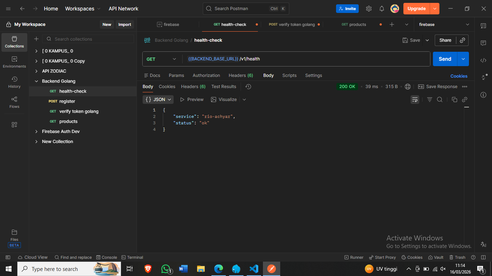
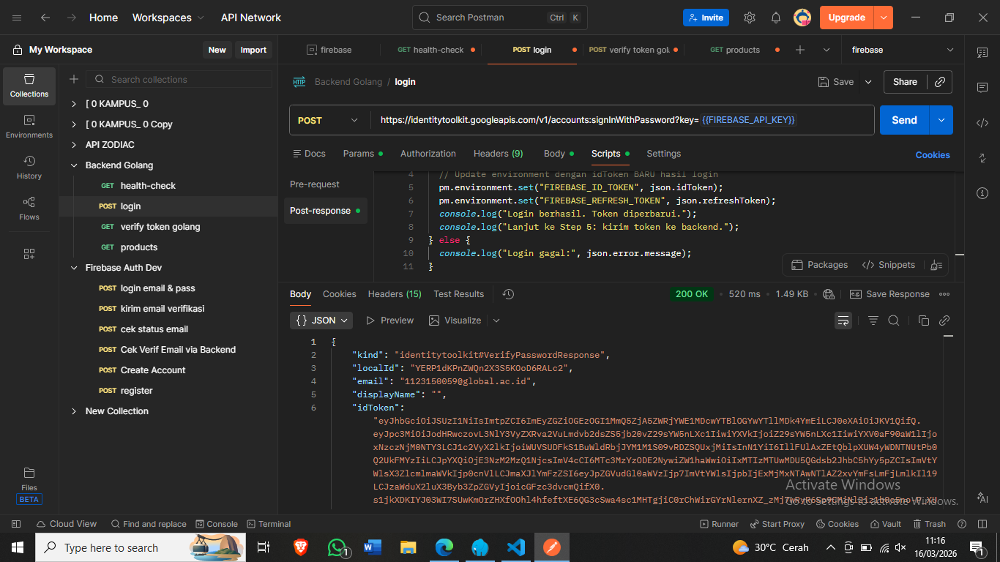
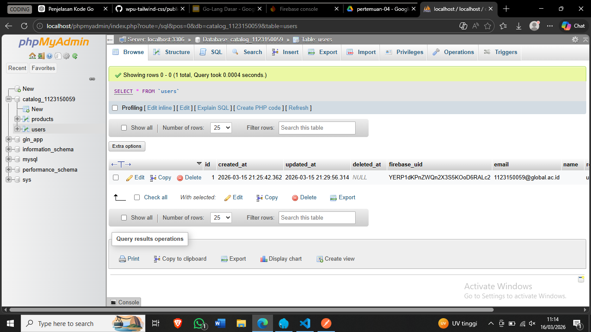
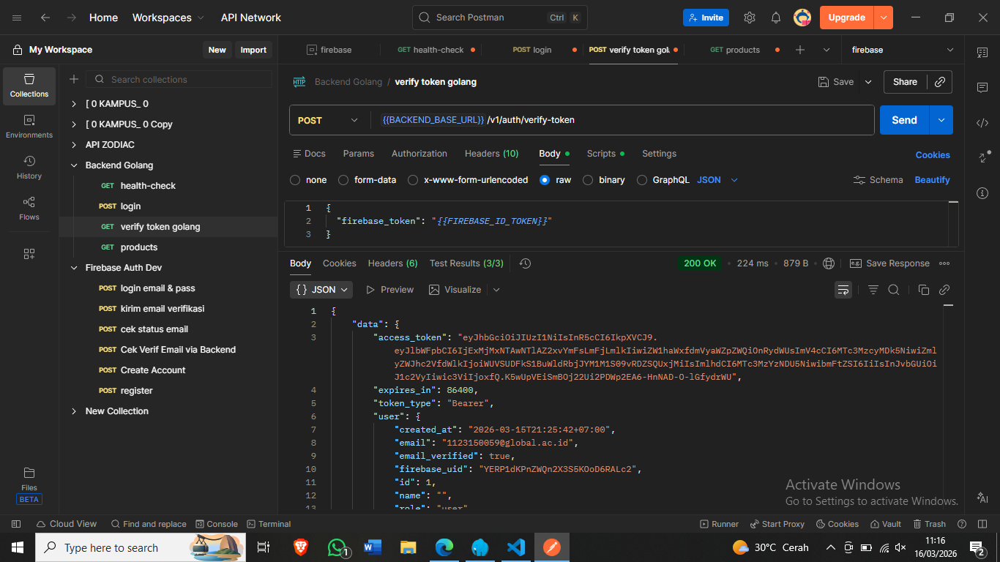
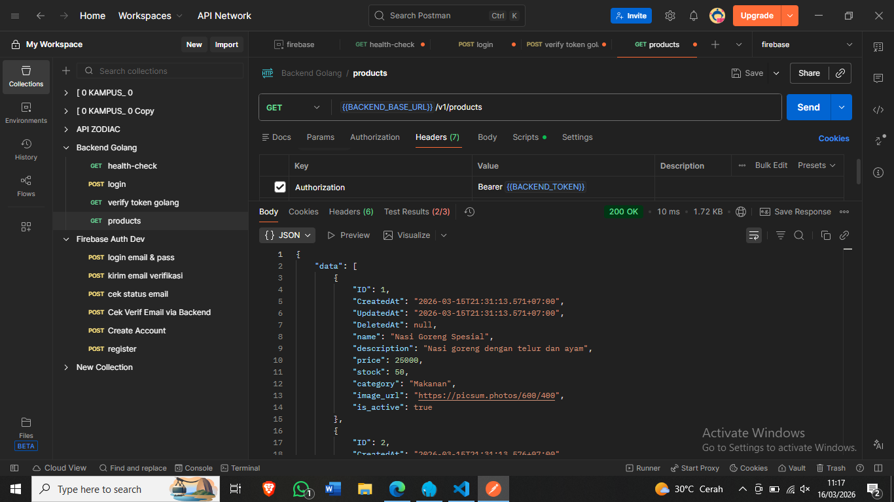
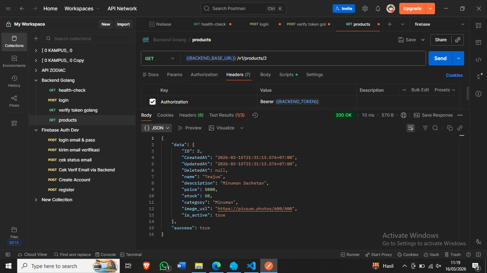
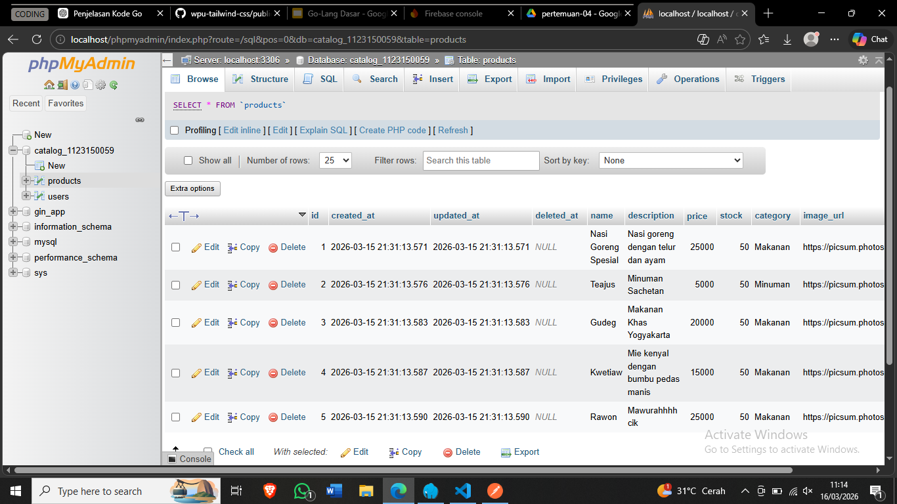
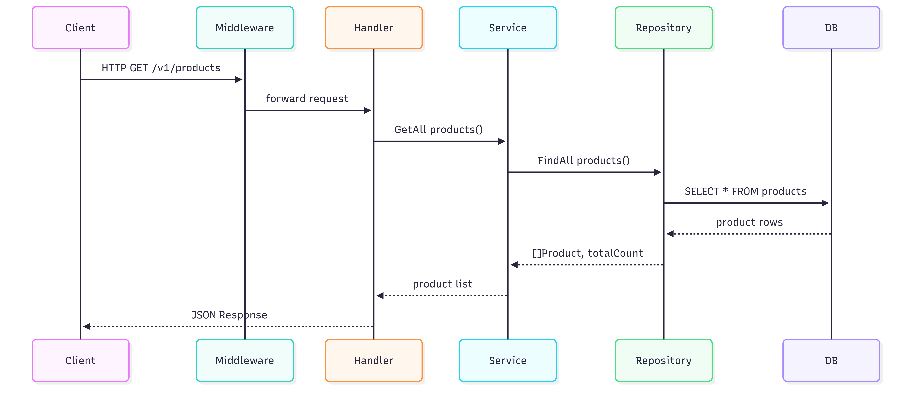
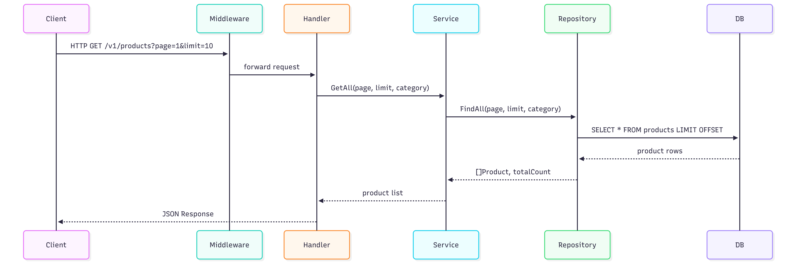

# Testing Endpoint


### Health Check
- Endpoint
```bash
GET

http://localhost:8080/v1/health

```

### Example



---

### Login

- Endpoint
```bash
POST

https://identitytoolkit.googleapis.com/v1/accounts:signInWithPassword?key={{FIREBASE_API_KEY}}
```

### Example




---

### Verifiy Token 
- Endpoint
```bash
POST

{{BACKEND_BASE_URL}}/v1/auth/verify-token
```


### Example


---

### Get All Product
- Endpoint
```bash
GET

{{BACKEND_BASE_URL}}/v1/products
```

### Example



---

### Get Product By id
- Endpoint
```bash
GET

{{BACKEND_BASE_URL}}/v1/products/2
```

### Example



---

# Seeder

- Command Running Seed
```bash
go run seeds/seed.go
```

### Setelah di run



---

# Flow (Sequence Diagram)

### User 



### Code
```bash
sequenceDiagram
participant Client
participant Middleware
participant Handler
participant Service
participant Repository
participant DB
Client->>Middleware: HTTP Request
Middleware->>Handler: forward request
Handler->>Service: CreateUser()
Service->>Repository: SaveUser()
Repository->>DB: INSERT USER
DB-->>Repository: OK
Repository-->>Service: user saved
Service-->>Handler: user response
Handler-->>Client: JSON Response
```

# Get All Product



### Code

```bash
sequenceDiagram
participant Client
participant Middleware
participant Handler
participant Service
participant Repository
participant DB

Client->>Middleware: HTTP GET /v1/products?page=1&limit=10
Middleware->>Handler: forward request
Handler->>Service: GetAll(page, limit, category)
Service->>Repository: FindAll(page, limit, category)
Repository->>DB: SELECT * FROM products LIMIT OFFSET
DB-->>Repository: product rows
Repository-->>Service: []Product, totalCount
Service-->>Handler: product list
Handler-->>Client: JSON Response
```
